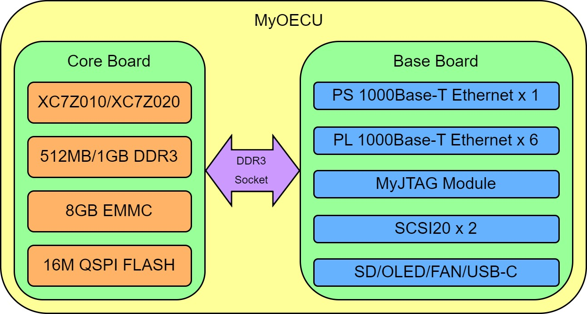

# 开源嵌入式计算单元

**MyO**pensource**E**mbedded**C**ompute**U**nit (**MyOECU**)

  

 

- ## 简介

本项目是一种开源嵌入式计算单元原型机，主要用于构建分布式控制系统，充当核心计算角色。通过板载的三路双冗余高速网络总线，本计算单元可以方便的与其他计算单元、传感器、交换机、作动器等实现互联互操作。使用基于PreemptRT的实时Linux操作系统，可快速实现应用软件开发。本计算单元适用于航空航天、工业控制、智能家居等诸多领域。

- ## 组成

1. 使用Zynq7010/7020作为主控制器，核心板通过DDR3接口与底板相连
2. 一路PS端千兆以太网接口
3. 六路PL端千兆以太网接口，搭配FPGA软件组成三组双冗余高速总线
4. 预留MyJTAG模块接口，包含一路JTAG调试接口与一路串口，共用一个USB Type-C接口与调试机相连
5. 主电源接口为USB Type-C接口，支持5V 3A输入，除此之外也可使用DB25扩展接口供电。主电源开关由负载开关组成，可由自锁按键或跳线帽驱动
6. 预留CAN总线接口、串口等IO资源，通过DB25接口与外部相连，预留SD卡接口
7. PCB尺寸为13cm*13cm

- ## 分布式控制系统

分布式控制系统相比集中式控制系统拥有较多优势：

1. 采用模块化设计，方便对子模块进行快速调试、维护、更换、升级等操作
2. 更好的故障隔离能力，对于设计良好的分布式系统，部分子模块损坏并不会影响整个控制网络的基本运行
3. 可灵活进行系统的余度配置，有利于提高系统的可靠性
4. 通用设计的计算单元可快速构建不同功能模块，降低系统研发成本，加快系统研发进度
5. 单个功能模块功耗较低，有利于系统的热设计
6. 各功能模块分散布置，从而避免因局部机械失效导致的灾难性后果

- ## 应用示例

